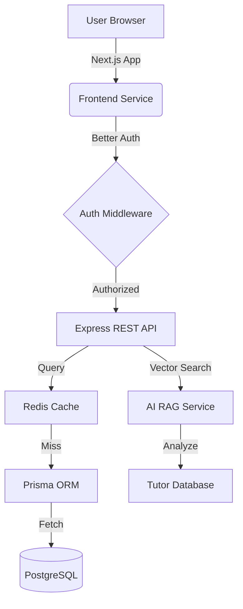

# 🌉 SkillBridge | Enterprise-Grade Tutor Booking Platform

[](https://nextjs.org/)
[](https://reactjs.org/)
[](https://tailwindcss.com/)
[](https://www.prisma.io/)
[](https://redis.io/)
[](https://www.better-auth.com/)

**SkillBridge** is a high-performance, full-stack marketplace designed to connect students with professional tutors through a structured booking system, real-time availability management, and secure authentication. It features a cinematic UI, AI-powered recommendations, and a robust backend architecture.

---

## ✨ Key Features

### 🤖 AI-Powered Tutor Recommendations (RAG)
Integrated a sophisticated **Retrieval-Augmented Generation (RAG)** service that analyzes student needs and recommends the most suitable tutors from our database in real-time.

### 🎭 Cinematic Motion & Glassmorphism
*   **Atmospheric UI:** Deep indigo palettes with animated gradient orbs and glassmorphic surfaces.
*   **Interactive UX:** Lens-magnifier zoom on tutor profiles and smooth layout transitions.

### 🔐 Enterprise Security & Auth
*   **Google Social Login:** Seamless authentication powered by `Better-Auth`.
*   **RBAC:** Strict Role-Based Access Control for Students, Tutors, and Admins.
*   **Secure Cookies:** Production-ready HTTP-only cookie management with cross-site handling.

### 📧 Newsletter & Engagement
Integrated a custom subscription service with form validation (Zod) and real-time feedback (Sonner) to keep students engaged with the latest tutor updates.

### 📅 Advanced Tutor Management
Tutors can manage their availability, set hourly rates, and track bookings through a dedicated, motion-rich dashboard.

### ⚡ Performance & Scalability
*   **Redis Caching:** Lightning-fast data retrieval for frequently accessed tutor profiles.
*   **Prisma ORM:** Type-safe database interactions with PostgreSQL.
*   **Next.js App Router:** Optimized server-side rendering and client-side navigation.

---

## 🛠️ Tech Stack

### Frontend
- **Framework:** Next.js 15 (App Router)
- **Library:** React 19
- **Styling:** Tailwind CSS 4.0 + Shadcn/UI
- **Animations:** Framer Motion
- **State Management:** Zustand
- **Forms:** React Hook Form + Zod

### Backend
- **Runtime:** Node.js
- **Server:** Express.js 5.0
- **Database:** PostgreSQL (via Prisma ORM)
- **Caching:** Redis
- **Auth:** Better-Auth

---

## 🏗️ System Architecture



---

## 🚀 Getting Started

### 1. Prerequisites
- Node.js (v20+)
- PostgreSQL Database
- Redis Instance

### 2. Installation
```bash
# Clone the repository
git clone https://github.com/sadik117/L2-A4-skillbridge-frontend.git

# Install Frontend Dependencies
cd assignment-4-frontend
npm install

# Install Backend Dependencies
cd ../assignment-4-backend
npm install
```

### 3. Environment Setup
Create a `.env` file in the backend and a `.env.local` in the frontend directory based on the provided examples.

### 4. Run the Platform
```bash
# Backend
cd assignment-4-backend
npm run dev

# Frontend
cd assignment-4-frontend
npm run dev
```

---

## 📸 Visual Showcase

> [!TIP]
> The platform uses a curated HSL color palette to ensure a premium look across all devices. The dark mode is optimized for accessibility and visual comfort.

---


<p align="center">
  Built with ❤️ by <a href="https://github.com/sadik117">sadik117</a>
</p>
